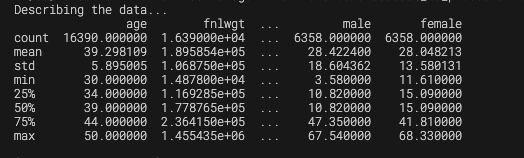

# Short Write Up

## 1. Word Count
To execute the word count, the following code inside of ```wc.py``` completed this task:
```
...
filtered = counts.filter(lambda x: x[1] >= 3)
...
```

Since the counts are key-reduced with the data structure (word, count), the second element of the tuple is the count of the word. By filtering the counts with a lambda function that checks if the count is greater than or equal to 3, the word count is executed.

It is also important to note that all the words had their special characters removed and were converted to lowercase to ensure that the word count was accurate. For example ```'it``` is translated into ```it```. For the purpose of this assignment, since it wasn't explicity stated, case sensitivity was not considered.

## 2. Spark-SQL
The following block was written to perform the task...
```
...
def select_age_rows(data: DataFrame):
    """
    select rows with 30 <= age <= 50
    """

    # Select rows with age between 30 and 50
    data = data.filter((data.age >= 30) & (data.age <= 50))

    # Turn frpm pyspark to pandas dataframe
    data_pd = data.toPandas()
    

    # Describe the data
    print("Describing the data...")
    print(data_pd.describe())

...
select_age_rows(data)
```

It is important to note that when the data is described, the description is not completely shown, as seen inside this image below. Through further experimentation, the ```data.write.format('csv').option('header', 'true').mode('overwrite').save('saved_data')``` line of code does not write the data into csv, but instead breaks it down into multiple files and stored. The name has also been changed to ```saved_data``` to avoid overwriting the original data.

